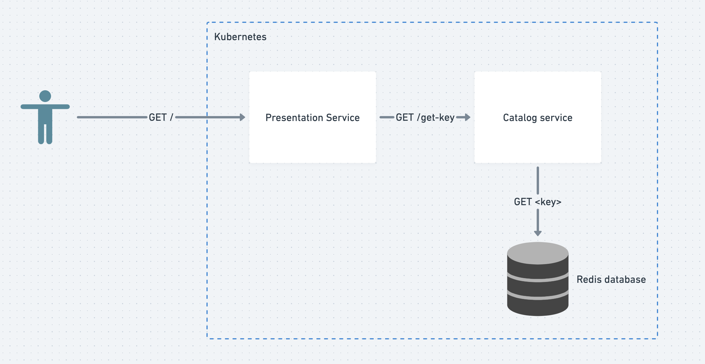

# Evaluation DIIAGE 3 P1 & 2

L'evaluation consiste en une serie de questions a faire sur votre machine dans le cluster kubernetes de l'exercice.

vous pouvez creer l'environnement en runnant:

```
kind create cluster --config cluster-config.yaml
```

Il vous faudra aussi installer un composant interne a kubernetes:

```
kubectl apply -f https://raw.githubusercontent.com/kubernetes/ingress-nginx/main/deploy/static/provider/kind/deploy.yaml
```

# Exercice

Le but de cet exercice va etre de deployer l'application suivante : 

### Redis

Afin de deployer le redis vous pourrez utiliser l'ArgoCD disponible sur la plateforme et la chart `helm` suivante: https://artifacthub.io/packages/helm/bitnami/redis.

Le redis devra necessairement avoir un mot de passe


### Service catalogue
- image: `luskidotme/catalog-service:v1`
- port: 3333
- variables d'environnement :
  - `REDIS_ADDR`: l'adresse du REDIS
  - `REDIS_PASSWORD`: password pour se connecter au redis

### Service presentation
- image: luskidotme/presentation-service:v1
- port: 4444
- variable d'environnement:
  - CATALOG_API_URL: URL du service `catalogue` sous la forme `http://<url>:<port>`
