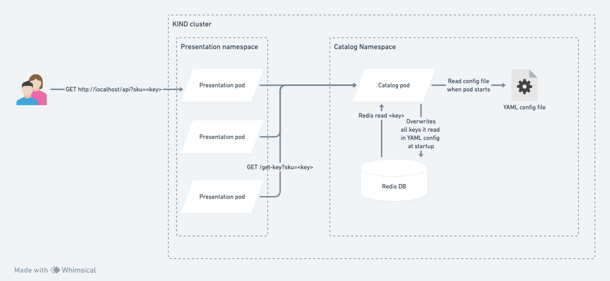

# Evaluation DIIAGE 3 P1 & 2

Nous avons developpe l'application suivante :  et voulons la mettre en production dans notre cluster kubernetes. Votre role est d'utiliser `Helm`, `kind` et `docker` pour deployer l'application.

Vous disposez des elements suivants:
- un dossier `/catalog` contenant le code du service un Dockerfile
- un dossier `/presentation` contenant le code du service ainsi qu'un Dockerfile
- un dossier `/setup` contenant une config `kind` + un fichier `ingress.yaml`.

**Le but a la fin de l'exercice est de construire les images ainsi qu'une charts helm par service** afin d'avoir tous les pods de l'application qui tournent dans votre cluster et de pouvoir appeler localement depuis votre navigateur `http://localhost:<port>/api?sku=<key>` et qu'il nous retourne bien les clefs du `catalog` que l'on demande

**Tout est a realiser dans ce dossier, a la fin du temps, veuillez faire un zip et l'envoyer sur Teams a Luc CHMIELOWSKI**


## Setup

Pour faire cet exercice, il vous faudra utiliser `kind` ainsi qu'installer un controlleur d'ingress.

- Vous devrez utiliser le fichier `setup/kind.yaml` pour creer votre cluster (utilisez le flag `--config` du CLI kind)
- Vous devrez installer le controller en appliquant le fichier `setup/ingress.yaml` dans votre cluster

## Documentation

### Service catalogue

Le service catalog est un service HTTP qui possede un endpoint `/get-key?sku=<key>` qui va chercher dans un redis la clef `<key>`

- port: 3333
- variables d'environnement:
  - `REDIS_ADDR`: l'adresse du REDIS sous la forme `<url>:<port>` (sans le `redis://` avant)
  - `REDIS_PASSWORD`: mot de passe pour se connecter au redis
  - `SETUP_FILE_PATH`: chemin vers un fichier qui est lu au demarrage par le conteneur pour charger les donnees dans le redis


Le `SETUP_FILE_PATH` doit pointer sur un fichier YAML clef-valeur de la forme:

```yaml
my-key: my-value
another-key: another-value
third-key: third-value
...
```

Ce fichier est lu au demarrage de l'application et chaque clef/valeur est enregistree dans le `redis`. (on peut donc recuperer une clef dans le redis en faisant `redis-cli GET my-key`)

### Service presentation

Le service presentation redirige les appels sur son endpoint`/` vers le endpoint `/get-key` du service `catalog`.

- port: `4444`
- variables d'environnement:
  - `CATALOG_API_URL`: URL du service `catalogue` sous la forme `http://<url>:<port>`

On souhaite faire en sorte que le service `presentation` puisse se dimensionner horizontalement automatiquement en fonction de l'activite avec un minimum de pods de 1 et un maximum de 3.
